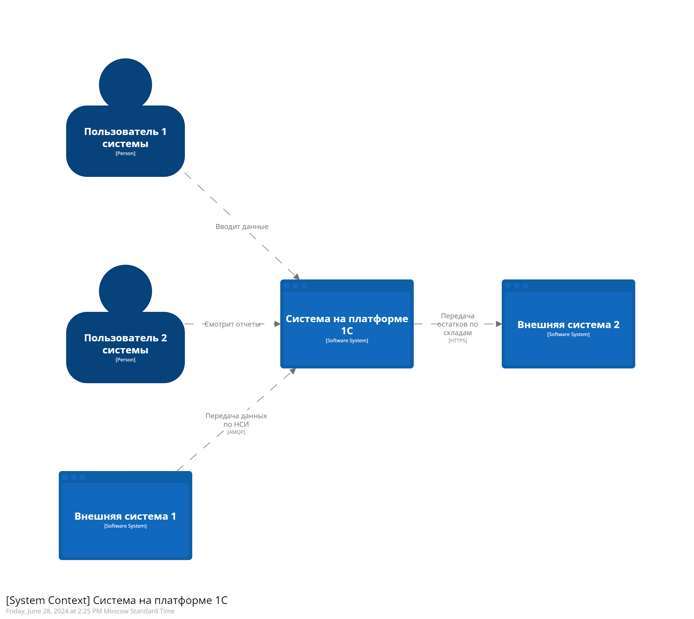
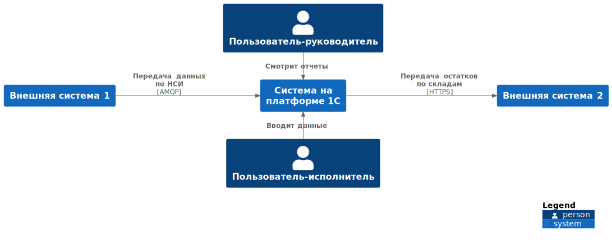
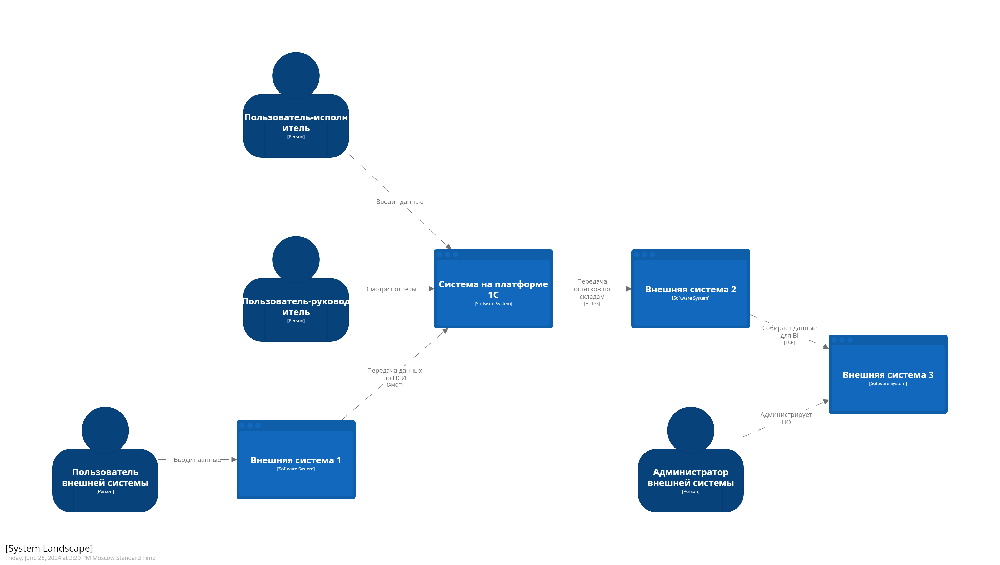
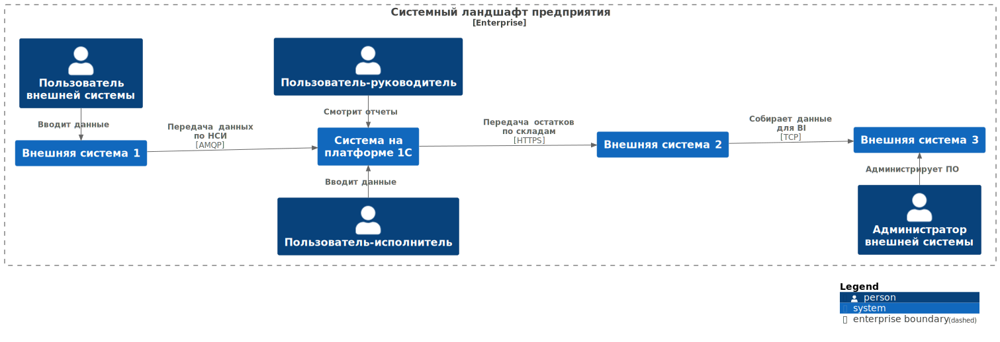
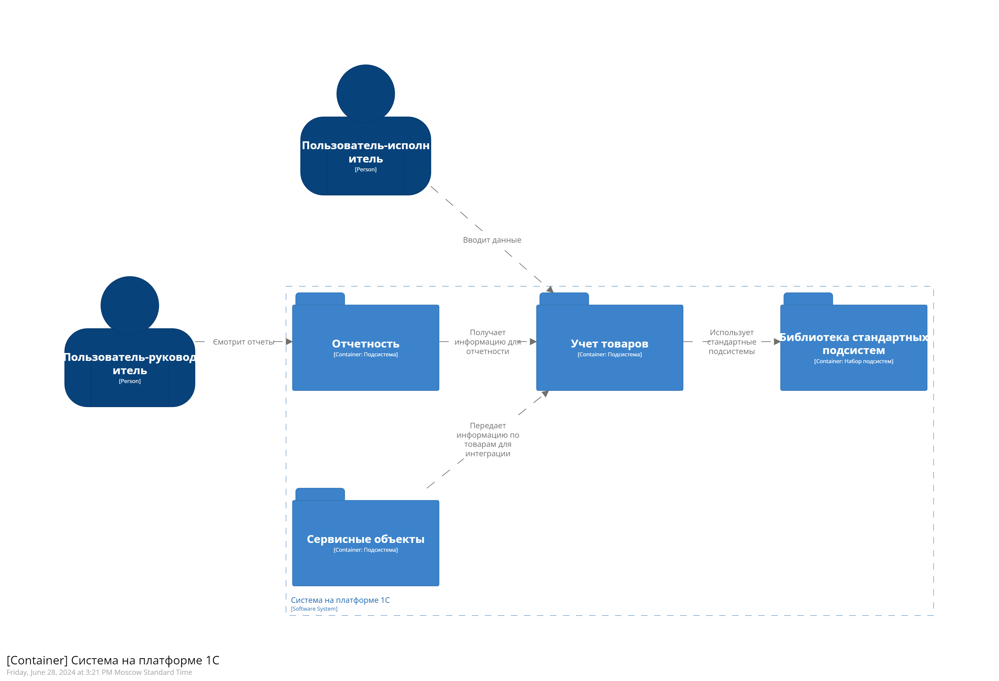
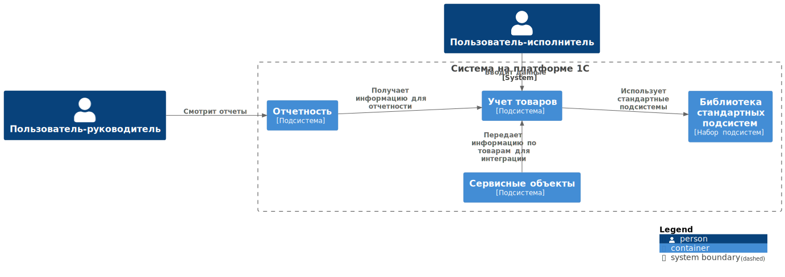
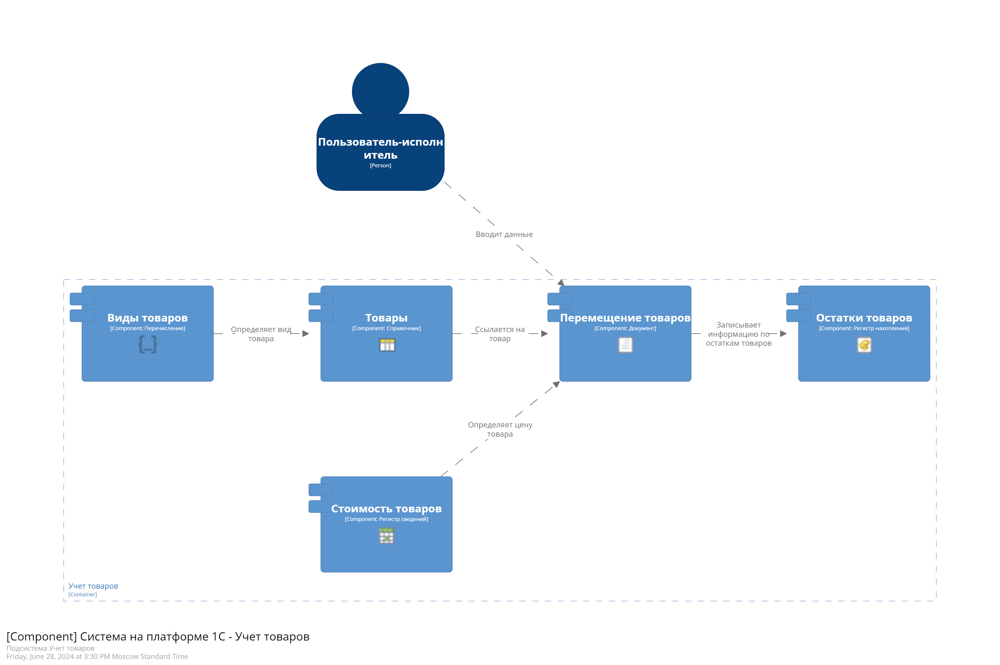
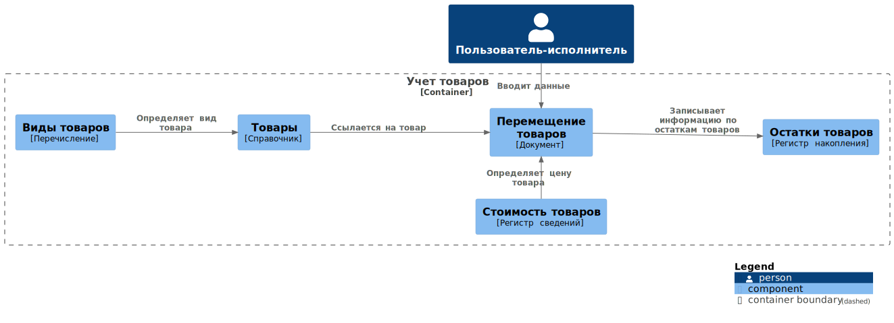
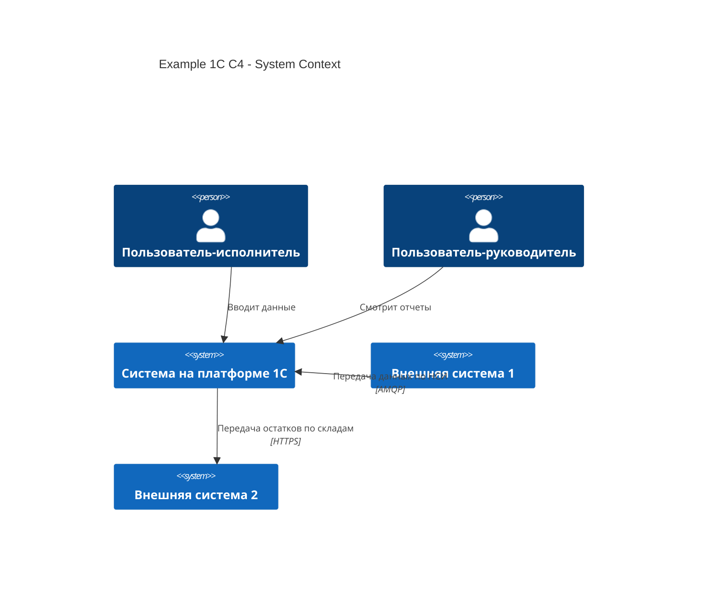

# Пример описания архитектуры системы 1С по модели C4

## Диаграммы как код

Подход является составной частью принципа "Архитектура как код", позволяя создавать несколько диаграмм архитектуры программного обеспечения из единой модели при помощи программных языков моделирования. Одной из таких моделей является [C4 (Context Container Component Code)](https://c4model.com/). Данный пример реализован на двух программных языках моделирования: [DSL Structurizr](https://structurizr.com/dsl) и [PUML](https://plantuml.com/).

## Модель C4

Модель С4 довольно трудно полноценно использовать для продумывания архитектуры системы. Особенно если мы говорим о архитектуре уровня ERP или, например, доработок типовых конфигураций. Существующие слои предлагается использовать в следующей интерпритации.

- Исходный код на [DSL](dsl)
- Исходный код на [PUML](puml)

### L1 - System Context (System Landscape) - Интеграционный ландшафт

Слой, на котором отображается как система взаимодействует с пользователями и другими внешними системами. По умолчанию в системный контекст входят только пользователи и системы, которые непосредственно взаимодействуют с основной системой. Если нам нужно видеть системы и пользователей, которые влияют на систему опосредованно, можно использовать вид System Landscape (Системный ландшафт), в котором будут отображены все системы, описанные в модели.
[Описание кода L1](docs/L1SystemContext.md)

Пример диаграммы системного контекста сгенерированной Structurizr

Пример диаграммы системного контекста сгенерированной PlantUML

Пример диаграммы системного ландшафта сгенерированной Structurizr

Пример диаграммы системного ландшафта сгенерированной PlantUML

Еще один пример диаграммы системного ландшафта сгенерированной PlantUML с детальным описанием

### L2 - Container - Подсистемы

В рамках описания архитектуры системы на платформе 1С контейнерами предлагается считать подсистемы конфигурации. При наличии большого количества подсистем и отсутствия требований к описанию каждой подсистемы можно объединять их в блоки (например, все подсистемы БСП в одном контейнере).
[Описание кода L2](docs/L2Container.md)

Пример диаграммы контейнеров (подсистем) сгенерированной Structurizr

Пример диаграммы контейнеров (подсистем) сгенерированной PlantUML

### L3 - Component - Объекты конфигурации

На слое компонентов детализируется состав объектов в подсистеме и описывается их взаимодействие. Компонентом является объект метаданных.
[Описание кода L3](docs/L3Component.md)

Пример диаграммы компонентов (объектов) сгенерированной Structurizr

Пример диаграммы компонентов (объектов) сгенерированной PlantUML

### L4 - Code - Код/Структуры данных

Не используется, но можно на этом уровне сделать принципиальное описание структуры общих модулей или ER-диаграммы объектов из слоя компонентов.

[Описание кода L4](docs/L4Code.md)

## Дополнительные инструменты визуализации диаграмм

В случае описания небольшой системы/подсистемы можно использовать [Mermaid](https://mermaid.js.org/syntax/c4.html) - инструмент для визуализации диаграмм, ренедринг которого поддерживается напрямую в GitHub. Синтаксис похож на PUML с некоторыми отличиями и ограничениями.

## Заимствования

[1ce-icons-for-plantuml](https://github.com/ovcharenko-di/1ce-icons-for-plantuml)
