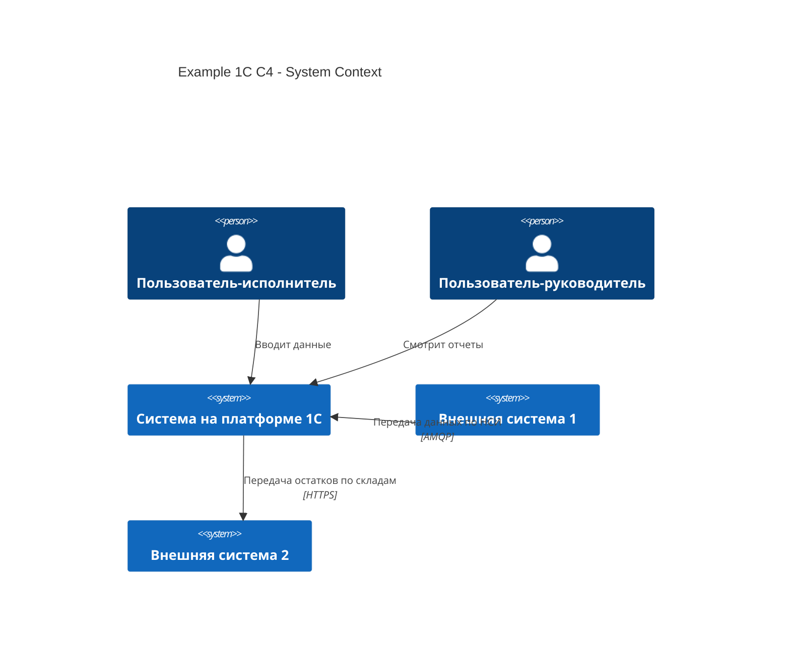

```mermaid
C4Context
title Example 1C C4 - System Context

Person(SystemUser1, "Пользователь-исполнитель")
Person(SystemUser2, "Пользователь-руководитель")
System(System1C, "Система на платформе 1С")
System(OtherSystem1, "Внешняя система 1")
System(OtherSystem2, "Внешняя система 2")

Rel(OtherSystem1, System1C, "Передача данных по НСИ", "AMQP")
Rel(System1C, OtherSystem2, "Передача остатков по складам", "HTTPS")
Rel_D(SystemUser2, System1C, "Смотрит отчеты")
Rel_U(SystemUser1, System1C, "Вводит данные")

```
